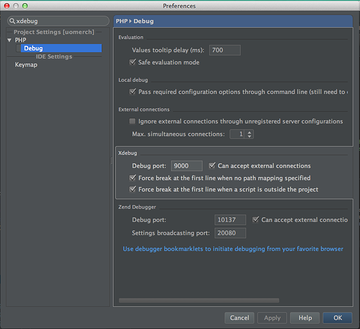

pubstack
========

Publisher's DevStack

## Installation

1. Install [Vagrant](http://www.vagrantup.com/).
1. Install [VirtualBox](https://www.virtualbox.org/).
1. Install Ansible:
    - [Latest Releases Via Homebrew (Mac OSX)](http://docs.ansible.com/intro_installation.html#latest-releases-via-homebrew-mac-osx)
    - [Latest Releases Via Apt (Ubuntu)](http://docs.ansible.com/intro_installation.html#latest-releases-via-apt-ubuntu)
    - [See all](http://docs.ansible.com/intro_installation.html#installing-the-control-machine)
1. Add project files to your machine (for example in `~Sites/www`).
1. Clone this repo:

    ```bash
    git clone git@github.com:NBCUOTS/pubstack.git
    cd pubstack
    ```

1. Install Hostupdater:

    ```bash
    vagrant plugin install vagrant-hostsupdater
    ```

1. Create your config file from the default template and modify as needed (note each config has commented instructions):

    ```bash
    cp default.config.yml config.yml
    vim config.yml
    ```

1. Start-up your vagrant box:

    ```bash
    vagrant up
    ```
    **NOTE:** after the initial `vagrant up`, you will want to run `vagrant reload` any time you edit your config file values.

1. Visit [http://pubstack.dev/](http://pubstack.dev/) in your browser.

## Authors
- breathingrock
- conortm
- ericduran
- scottrigby

## Setting up your IDE for debugging
1. In PhpStorm type `command + comma`. This will open up preference settings.
1. Search for **xdebug** and you should show something similar to the following:

    

     - Make sure `Debug port` is set to `9000`
     - Make sure `can accept external connections` is checked
1. Then in your workspace, click the telephone icon `Start Listen for PHP Debug Connections`

## Troubleshooting

### VPN
Cisco Anyconnect Mobility Client will not play nice with Vagrant, unless you run
this script we've conveniently added:

```bash
./scripts/cisco.workaround.sh
```
You will be prompted for your password. Note you may need to run this twice.
